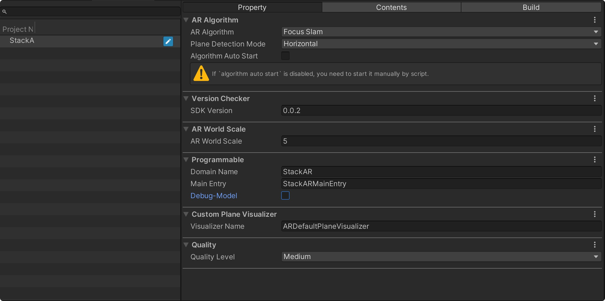
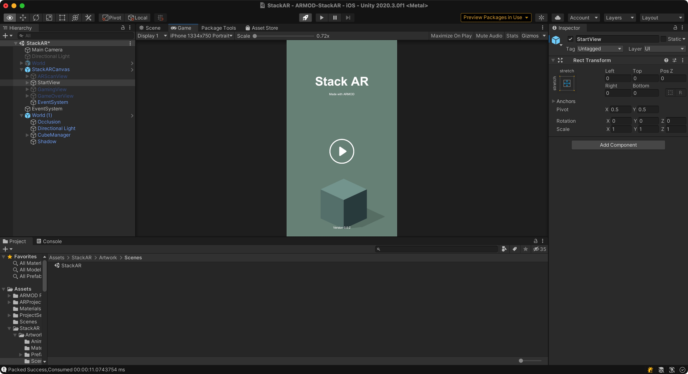

# ARMOD-StackAR
This repository is made with [ARMOD SDK](!https://phantomsxr.com).
And here is a **Stack Game of AR version.**

[![[Free AR SDK] The same AR SDK as Lens Studio and Spark AR -- ARMOD](https://res.cloudinary.com/marcomontalbano/image/upload/v1625650836/video_to_markdown/images/youtube--WHeBJ9EpJb8-c05b58ac6eb4c4700831b2b3070cd403.jpg)](https://youtu.be/WHeBJ9EpJb8 "[Free AR SDK] The same AR SDK as Lens Studio and Spark AR -- ARMOD")

## What is AR-MOD

In short, ARMOD's solution is an AR experience platform solution similar to Snapchat (Lens Studio) and Facebook (SparkAR)! But Lens Studio and Spark AR editors do not provide SDK, Not Support Unity Engine!

AR-MOD is a derivative framework based on Unity ARFoundation. MOD in AR-MOD means Modification in English, meaning: modification and module. This concept is widely used in games, corresponding to modifiable video games. Famous games such as Warcraft, Red Alert, Half-Life, CS, Victory Day and more!

We transplant the MOD concept into AR technology to give users more freedom to create the AR creative interactive experience content they need! In this process, users do not need to worry about AR-SDK algorithm and code implementation, but only need to devote themselves to the production of AR creative interactive experience content. With only a small amount of code, you can use all the capabilities of AR-MOD on the APP to create greater commercial value.

>If you Interested AR-MOD you can go to our [website](!https://phantomsxr.com) and [document site](!https://docs.phantomsxr.com/)

# How to use with ARMOD SDK

## Packing
1. Clone or download this repository
2. Add and open this project with **Unity 2020.3** 
3. Open [PackageTools](!https://docs.phantomsxr.com/development-kit/package-tools) by `Tools`->`ARMOD`->`PackageTools`
4. Build your owner AR Experience

## Hosting
1. Go to our [dashboard](!https://phantomsxr.com/dashboard/apps/)
2. And uploading

> More about out dashboard you will go to https://docs.phantomsxr.com/development-kit/dashboard.

### Subscribe to us for more information and tutorials about AMROD.

Youtube: https://www.youtube.com/channel/UCf98zocVgz1FGF6jgx4N-oA 
Twitter: https://twitter.com/Phantom74605762
